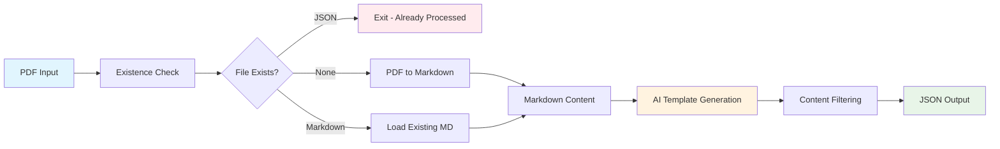

# 🚀 Templt - Fields to Json

> **Transform unstructured PDF documents into clean, structured JSON templates with AI-powered extraction**

---

## 📋 Table of Contents

- [Overview](#overview)
- [UI/UX](#UI/UX)
- [Features](#features)
- [Architecture](#architecture)
- [Installation](#installation)
- [Usage](#usage)
- [Project Structure](#project-structure)
- [Workflow](#workflow)
- [Code Documentation](#code-documentation)
- [Example Output](#example-output)
- [Configuration](#configuration)

---

## Overview

**Templt** is an intelligent document processing system that converts PDF files into structured JSON templates. It uses **Gemini-2.5-flash** to extract and organize information from documents like Standard Operating Procedures (SOPs), creating consistent, machine-readable formats for further processing.

## UI/UX

- Basic HTML input type requesting for a file
- A submit button to submit the file to our endpoint
- A json response directly in browser
- **Everything needed at one place**

## Features

| Feature | Description |
|---------|-------------|
| 📄 **PDF to Markdown** | High-quality PDF text extraction with formatting preservation |
| 🤖 **AI Template Generation** | Intelligent content structuring using Gemini 2.5 Flash |
| 💾 **Smart Caching** | Avoids reprocessing existing files |
| 🗂️ **Organized Output** | Clean directory structure for all generated files |
| ⚡ **Fast Processing** | Optimized pipeline for quick conversions |
| 🔧 **Configurable** | Easy-to-modify prompts and settings |

---

## Architecture



---

## Installation

### Prerequisites

- Python 3.8+ (3.11 Here)
- Gemini API access
- Required Python packages (see requirements)

---

## Usage

###  Use

- Create a virtual environment
- install the dependencies in `requirements.txt`
- run `server.py`
- run the fastapi swagger and upload the file
- Markdown in Markdown folder under the directory od input file name
- JSON file in Template folder in file.json format
---

## Project Structure

```
templt/
├── 📄 Templt.py                 # Main orchestration script
├── 📁 src/
│   ├── 📄 PDF2Markdown.py       # PDF to Markdown conversion
│   ├── 📄 Markdown2Json.py      # AI-powered JSON generation
│   ├── 📁 config/
│   │   ├── 📄 config_openai.py  # API configuration
│   │   └── 📄 prompts.yaml      # System prompts
│   └── 📁 utilis/
│       ├── 📄 checkExisting.py  # File existence validation
│       ├── 📄 filterMarkdown.py # Content cleaning utilities
│       ├── 📄 jsonWriter.py     # JSON file operations
│       └── 📄 load_prompt.py    # Prompt loading utilities
├── 📁 misc/
│   ├── 📄 cuda_test.py          # Test code for cuda availability
│   └── 📄 installer.py          # script to install requirements
├── 📁 PDF/                      # Input PDF files
├── 📁 Markdown/                 # Generated Markdown files
├── 📁 Template/                 # Output JSON templates
└── 📄 requirements.txt          # Python dependencies
```

---

## Workflow

### 1. **Input Validation** 
The system first checks if the requested file is PDF or not.

### 2. **PDF Processing**
Using the `marker` library, PDFs are converted to high-quality Markdown format with preserved formatting.

### 3. **AI Template Generation**
The Markdown content is sent to Gemini 2.5 Flash with carefully crafted prompts to extract structured information.

### 4. **Content Cleaning**
Generated templates are cleaned to remove unnecessary formatting characters and ensure valid JSON output.

### 5. **Output Generation**
Final JSON templates are saved with organized directory structure for easy access.

---

## Code Documentation

### Core Modules

#### `server.py` - Start Server
The lazy script that starts the server using subprocess

```python
import subprocess

# Start uvicorn
process = subprocess.Popen(
  ["uvicorn", "Templt:app"],
)
```

#### `Templt.py` - Server Code
The FASTAPI server code for the project to request a pdf file

```python
@app.post("/pdf")
async def upload_pdf(file: UploadFile = File(...)):
  """
  Request a file in PDF format

  Args:
    file: A file from user

  Return:

    JSONRESPONSE of template
  """
```

#### `trigger.py` - Main Orchestrator
The primary script that coordinates the entire conversion process.

```python
def trigger(file_name, file_bytes):
  """
  The main file for coordination

  Args:
    file_name: The name of file input
    file_bytes: The content of dile in bytes

  Return:
    structured format of template
  """
```

#### `PDF2Markdown.py` - Document Conversion
Handles the conversion from PDF to Markdown format.

```python
def makeMd(input: str, fname: str, status: str = "NO", output: str = "Markdown"):
    """
    Converts PDF to Markdown format
    
    Args:
        input: Path to PDF file
        fname: Output filename
        status: Processing status (NO/MD/JSON)
        output: Output directory
        
    Returns:
        str: Markdown content
    """
```

#### `Markdown2Json.py` - AI Template Generation
Uses AI models to generate structured JSON from Markdown content.

```python
def TemplateGen(content: str):
    """
    Generates JSON template from Markdown content
    
    Args:
        content: Markdown text content
        
    Returns:
        str: Generated JSON template
    """
```

### Utility Functions

#### `checkExisting.py` - Smart Caching
```python
def checkPDF(fname: str):
    """
    Input:
        Takes file as input to check if PDF or not
    """
```

#### `filterMarkdown.py` - Content Cleaning
```python
def remove_backticks_and_json(text):
    """
    Removes formatting artifacts from AI-generated content
    """
```

---

## Example Output

### Input: SOP PDF Document
A standard operating procedure document containing company policies and processes.

File: [SOP](./PDF/SOP.pdf)

### Output: Structured JSON Template

```json
{
  "companyInformation": {
    "companyName": "",
    "address": "",
    "contactPhoneNumber": "",
    "contactEmail": ""
  },
  "generalInformation": {
    "processTitle": "",
    "department": "",
    "contactInformation": "",
    "sopId": "",
    "effectiveDate": "",
    "revisionNumber": ""
  },
  "processOverview": {
    "processDescription": "",
    "purposeAndScope": "",
    "definitionsAndRelatedDocuments": ""
  },
  "processSteps": [
    {
      "wbs": "",
      "task": "",
      "owner": ""
    }
  ]
}
```

### Benefits of This Structure

- **Standardized Format**: Consistent across all processed documents
- **Machine Readable**: Easy to parse and process programmatically
- **Extensible**: Template can be modified for different document types
- **Validation Ready**: Structure allows for easy data validation

---

## Configuration

### API Configuration
Edit `src/config/config_openai.py`:

```python
import openai

client = openai.OpenAI(
    api_key="your-api-key-here",
    base_url="https://generativelanguage.googleapis.com/v1beta/openai/"
)
```

### Prompt Customization
Modify `src/config/prompts.yaml`:

```yaml
sys_prompt_pdf: >
  You are an AI designed to analyze Standard Operating Procedures (SOPs)
  and extract their structural blueprint. Your task is to identify all
  distinct sections, sub-sections, and data points, then represent this
  inherent hierarchy as a blank JSON template.

  **Instructions:**
```
---